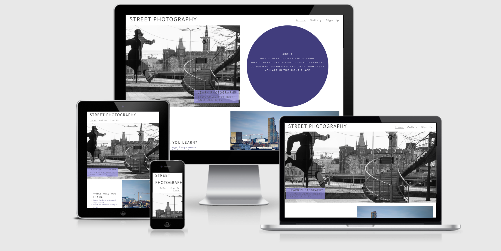

# Portfolio Project 1 - Street Photography
## Purpose

Website for street photography course around Stockholm streets. Providing information, a gallery and a sign up page. 

This Website was created for the purpose of completing the Portfolio 1 project for the Code Institute's Full Stack Developer course and is entirely fictional.
The project covers HTML and CSS with a user centric approach in mind.  A full list of technologies used can be found in the technologies section of this document. Note that GitHub as of March 2021 automatically creates a Table of Contents for the README file.

The live website can be found [here](https://jnehmeh87.github.io/project_one/)

## Street Photography Responsive Website

*** 
## User Experience (UX)

### User stories

#### First Time Visitor Goals
* As a First Time user, I want to understand the main purpose of the site at a glance and learn more about the course and its benefits.
* As a First Time user, I want to check some photos taken by the mentor of this course.
* As a First Time user, I want to view the website and content clearly on different size devices.

#### Returning Visitor Goals
* As a Returning user, I want to be able to book a course or sign up.

#### Frequent Visitor Goals
* As a Frequent user, I want to check if there are added content to the gallery page and check new dates updated regularly

### Design

#### Color Scheme
The Index page contains a start image sided with a circle with some convincing infortiom about the course. The color scheme consists of 2 colors rgba(34, 26, 107, 0.856) and rgba(153, 144, 235, 0.7).

#### Imagery
Images on index page and gallery page are meant to provide results of quality of pictures and to inspire the user to sign up.	

#### Typography
Tajawal and Montserrat from Google Fonts are used, with Sans Serif as fallback font.

#### Differences to Design
* The Sign up button on index page send us to the for where the user provide their contact info and choose their level of expertise. 
* Icons from font awesome were added to the footer, form and time section, this displayed more visually pleasing, while maintaining the visual cue for expected form contents.
* Header was split in 2 rows for mobile devices to keep visual integrity and readibility of header and navbar.

### Structure 
* The Home page follows a Z-shape design with the start image and a circle shape About the course on top and then sections about description and price, finishing with a button linking to the Sign up sheet.
* The Courses page displays overview information availabe without scrolling. Page links as well as scrolling enables expanded information further down on the page.
* The gallery page displays images.
* The Sign up page has a form to submit.

No submenues are used and the navbar indicates to the user where they are at all times. THe Home page and courses page has direct links to the call to action - i.e. the book page.

### Wireframes
Wireframes are sketched by hand and can be viewed here - [View](wireframes/wireframes.jpg)

## Features
* Internal links (within sheet and between sheets) - both in nav bar and on the sheets
* External links (social media)
* Sign up form 
* Images

### Future features
* A booking form sending the data to the business owner - current form uses form method get and clears the form upon submit.
* More courses and pages of behind the scene

## Technologies
### Languages used
* HTML5
	* This project uses HTML5 as the main language for content and structure of the Website.
* CSS3
	* This project uses CSS3 for Website styling

### Frameworks, Libraries & Programs used
* [Font Awesome](https://fontawesome.com/)
	* Font awesome Icons are used 
* [Google Fonts](https://fonts.google.com/)
	* Google fonts are used throughout the project to import the relevant fonts
* [GitHub](https://github.com/)
	* GithHub is the hosting site used to store the source code for the Website and [Git Pages](https://pages.github.com/) is used for the deployment of the live site.
* [GitPod](https://gitpod.io/)
	* GitPod is used as version control software to commit and push code to the GitHub repository where the source code is stored.
* [Google Chrome Developer Tools](https://developers.google.com/web/tools/chrome-devtools)
	* Google chromes built in developer tools are used to inspect page elements and help debug issues with the site layout and test different CSS styles.
* [Am I Responsive?](http://ami.responsivedesign.is/)
	* Used to generate the screenshots for responsive design.

## Testing

### Validation
The W3C Markup Validator and W3C CSS Validator Services were used to validate every page of the project. All pages of the final website passed validation without errors.
-   [W3C Markup Validator for index](assets/images/w3c-index.png)
-	[W3C Markup Validator for gallery](assets/images/w3c-gallery.png)
-	[W3C Markup Validator for signup](assets/images/w3c-signup.png)
-   [W3C CSS Validator](assets/images/w3c-css.png) 

### Bugs
* The about div disappear to low screen sizes under 1380px.

## Deployment
### GitHub Pages

The project was deployed to GitHub Pages through the below steps:

1. Log in to GitHub and locate the [GitHub Repository](https://github.com/jnehmeh87/project_one)
2. Click the "Setting" button "Settings" Button.
3. In the left menu, scroll down to "Pages".
4. Under "Source", click the dropdown and select "Branch: main/master", then click "Save".
5. Once deployed, the now published site [link](https://jnehmeh87.github.io/project_one/) is found in the "Pages" section.

## Credits
### Images
* All images on this site are my own.

### Acknowledgements

-   To my Mentor [Chris Quinn](https://github.com/10xOXR) the best tutor I received in years. Very helpful and pushing me to be best. Definitly recommend for all.
